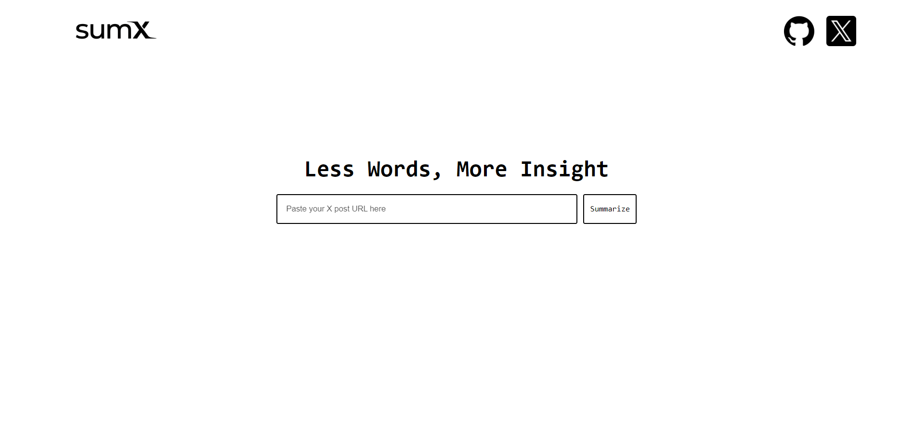
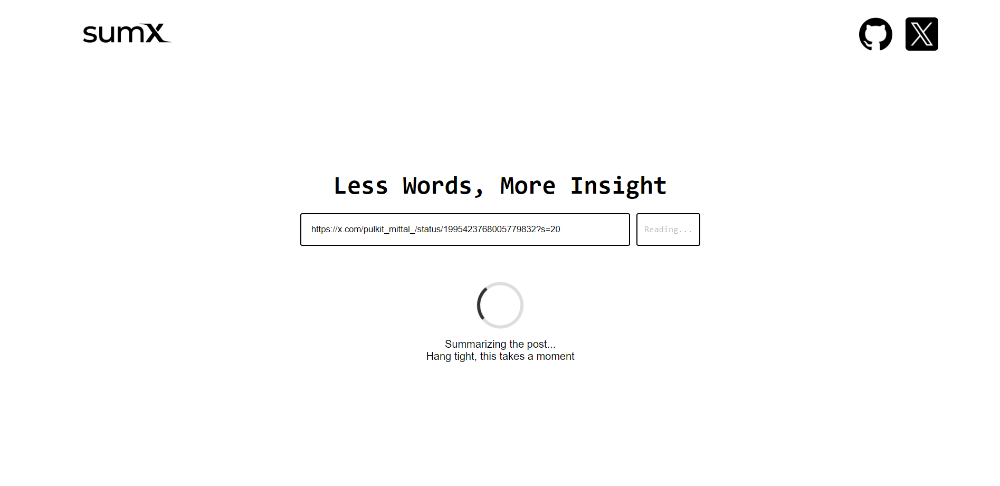
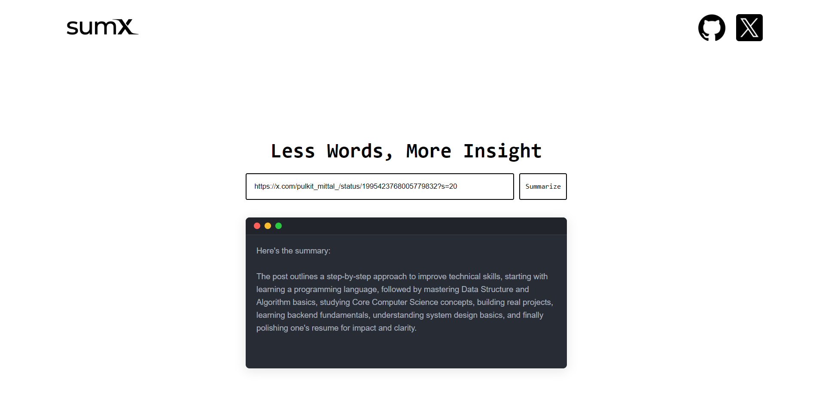

<div align="center">

# 🎯 **sumX – AI Powered Tweet Summarizer**


<br>
<br>
🔗 <strong>Live Demo:  https://sum-x.onrender.com </strong>
<br>

### 🚀 *A lightning-fast AI summarizer for tweets, powered by Node.js, React.js, Redis & Groq LLM.*


</div>

<p align="center">

<a href="https://github.com/akshitsharma-git/sumX/stargazers">
  
</a>


<a href="https://github.com/akshitsharma-git/sumX">
  
</a>

<a href="https://github.com/akshitsharma-git/sumX/commits">
  
</a>
<br>


</p>


---

# 📌 **Overview**

SumX is a fast, minimal, and intelligent summarization tool that extracts text from **X (Twitter) posts**, processes it using **Groq LLM**, and delivers concise summaries in seconds.

With **Redis caching**, repeated summaries are returned almost instantly, giving users a blazing-fast experience.

---

# ✨ **Features**

- 🔗 **Paste any X post URL → Get an instant summary**  
- ⚡ **Redis-powered caching for ultra-fast responses**
- 🤖 **AI summarization via Groq LLM**
- 🐶 **Web scraping powered by ScrapingDog**
- 🎨 **Minimal, clean UI (React)**  
- 🚀 **Production-ready backend (Node + Express)**  
- 🧪 **Error-handled and optimized API routes**  
- 🌐 **Deploy-ready on Render**

---

# 📸 **Demo Preview**




---

# 🛠 **Tech Stack**

| Layer | Technology |
|-------|------------|
| **Frontend** | React.js, CSS |
| **Backend** | Node.js, Express.js |
| **AI Inference** | Groq LLM |
| **Caching** | Redis |
| **Deployment** | Render |
| **Version Control** | Git + GitHub |

---

# 🔍 How It Works

1. User pastes an X post URL  
2. ScrapingDog extracts tweet content  
3. Redis checks for cached summary  
4. Groq LLM generates a new summary (if not cached)  
5. Frontend displays concise output  

---

# 📁 **Project Structure**

```bash
sumx/
│
├── backend/
│ ├── server.js
│ ├── redis.js
│ ├── routes/
│ ├── models/
│ ├── middlewares/
│ └── controllers/
│
├── frontend/
│ ├── src/
│ ├── public/
│ │  └── assets/
│ ├── index.html
│ └── package.json
│
├── package.json
└── .env
```

---

# ⚙️ Environment Variables

### `.env` in sumX Folder

```bash
PORT=1111 
SCRAPINGDOG_API_KEY=your_scrapingdog_api_key 
GROQ_API_KEY=your_groq_api_key 
REDIS_URL=your_redis_url
```

---

# 🧪 Local Development Setup

### Backend (inside the root sumX folder)
```bash
  npm install
  npm start
```

### Frontend (inside the frontend folder)
```bash
  cd frontend
  npm install
  npm run dev
```
---

# 🧠 **Philosophy**

> Speed matters. Clarity matters more.

SumX is built to cut through information overload by delivering **clear, concise insights** from noisy X (Twitter) content—without compromising performance or simplicity.

The focus is on **minimal UI**, **fast inference**, and **production-ready architecture** that scales.

---


# 📜 License

This project is licensed under the MIT License.

---

<div align="center" >
  <strong>If you like this project, please consider giving it a star on GitHub! ⭐</strong>
</div> 
<br>
<p align="center">Made with ❤️ by Akshit Sharma</p>


